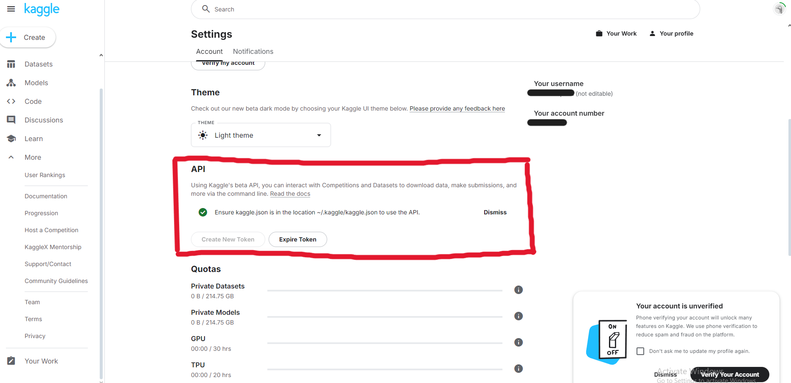
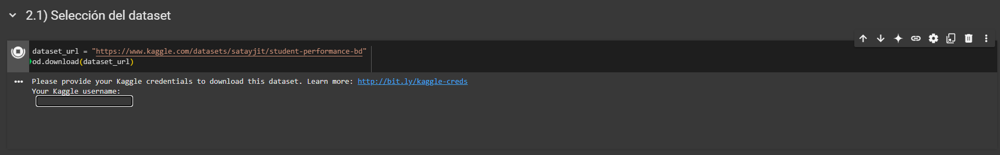

# Tarea 2 Algoritmos, Redes y Equidad

### Debe clonar este repositorio en una carpeta local en su computador utilizando $git clone

### Ábralo con VSCode e instale la extensión de Jupyter correspondiente. (cuando vaya a correr la primera celda VSCode recomendará una si no tiene ya).

### Asegúrese de utilizar un ambiente virtual vacío o que no ocasione problemas con las librerías a utilizar.

### Para correr el código es necesario instalar las siguientes librerías de python:
- opendatasets
- scikit-learn
- fairlearn
- aif360

### Además, es necesaria una llave de API de Kaggle en formato JSON, que se puede obtener en la configuración del sitio.

### Al correr el extracto de código de la imagen, Kaggle pedirá el ingreso de credenciales, por lo que es necesario obtenerlas de antemano.

### Luego, para correr el resto de las celdas de código, es necesario apretar el botón de play a la izquierda de cada una, lo que reproducirá los resultados entregados.